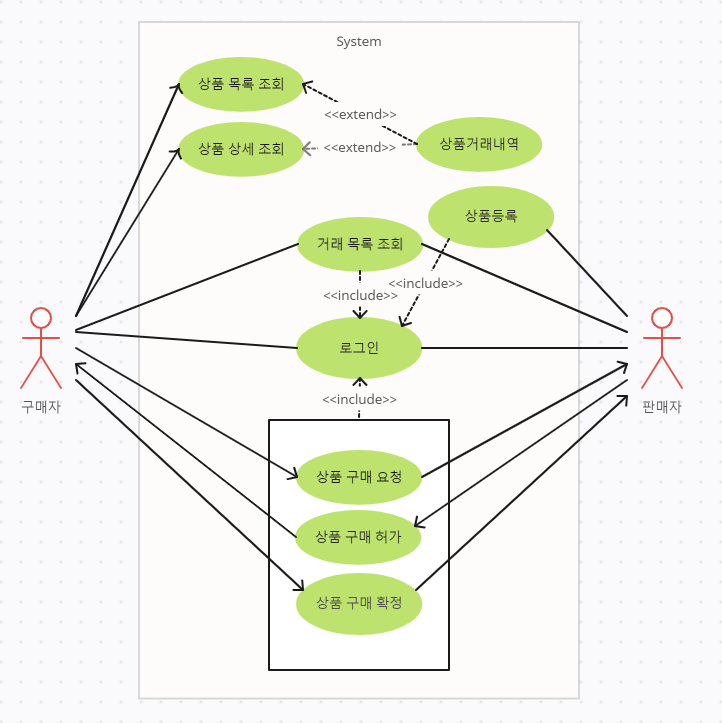
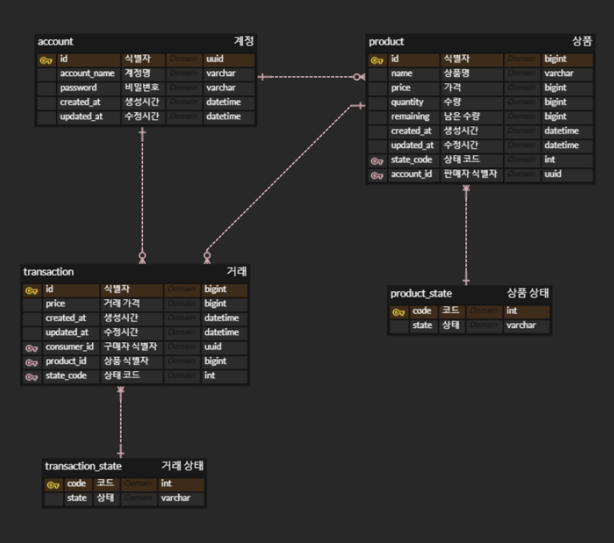
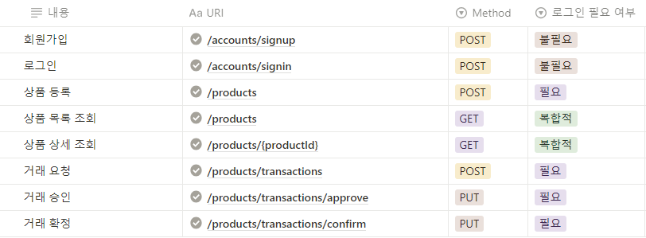
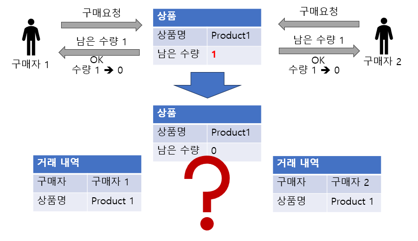
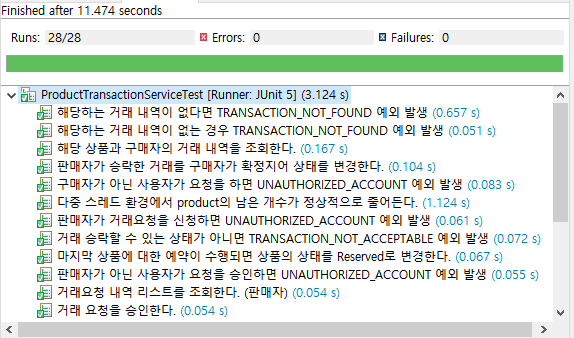

# wanted 6월 back-end 챌린지

## 상품 판매 서버 제작 과제

> 과제 요구 사항
> 
> 1. 제품 등록과 구매는 회원만 가능합니다.
> 2. 비회원은 등록된 제품의 목록조회와 상세조회만 가능합니다.
> 3. 등록된 제품에는 “제품명”, “가격”, “예약상태”, “수량”이 포함되어야하고, 목록조회와 상세조회시에 예약상태를 포함해야합니다.
> 4. 제품의 상태는 “판매중”, “예약중”, “완료” 세가지가 존재합니다.
> 5. 구매자가 제품의 상세페이지에서 구매하기 버튼을 누르면 거래가 시작됩니다.
> 6. 판매자와 구매자는 제품의 상세정보를 조회하면 당사자간의 거래내역을 확인할 수 있습니다.
> 7. 모든 사용자는 내가 “구매한 용품(내가 구매자)”과 “예약중인 용품(내가 구매자/판매자 모두)”의 목록을 확인할 수 있습니다.
> 8. 판매자는 거래중인 구매자에 대해 ‘판매승인’을 할 수 있고, 구매자는 판매승인한 제품에 대해 ‘구매확정’을 하는 경우 거래가 완료됩니다.
> 9. 다수의 구매자가 한 제품에 대해 구매하기가 가능합니다. (단, 한 명이 구매할 수 있는 수량은 1개 뿐입니다.)
> 10. 거래가 시작되는 경우 수량에 따라 제품의 상태가 변경됩니다.
>     1. 추가 판매가 가능한 수량이 남아있는 경우 - 판매중
>     2. 추가 판매가 불가능하고 현재 구매확정을 대기하고 있는 경우 - 예약중
>     3. 모든 수량에 대해 모든 구매자가 모두 구매확정한 경우 - 완료
> 11. “구매한 용품”과 예약중인 용품” 목록의 정보에서 구매하기 당시의 가격 정보가 나타나야합니다.
>     1. 예) 구매자 A가 구매하기 요청한 당시의 제품 B의 가격이 3000원이었고 이후에 4000원으로 바뀌었다 하더라도 목록에서는 3000원으로 나타나야 합니다.
> 12. 구매취소는 고려하지 않습니다.

### use case 다이어그램

### ERD

### API 명세서

### 기술 스택

- Java
- Spring Boot
- JPA
- Spring Security
- Junit
- MySQL

### 고려 사항

- Lock
    
    
    
    - 다수의 요청이 동시에 들어온 경우 원하는 바와 다르게 동작할 수가 있습니다. 이러한 문제가 생길 위험이 있는 코드에 lock을 적용하여 하나의 요청이 끝난 이후에 다음 요청을 처리할 수 있도록 하였습니다.
- 테스트 코드
    
    
    
    - 의미가 있다고 판단되는 로직에 테스트 코드를 작성하였습니다. 이로 인해 작성한 코드가 정상적으로 예상된 결과가 나오는지 확인하고, 이후 신뢰성 있는 리팩토링 작업이 가능해졌습니다.
- 예외 처리
    - 요청에 대한 오류 발생 시 예외 처리를 하지 않으면 Spring 내부에서 자체적으로 메시지를 반환합니다. 이를 가지고는 사용자는 무엇으로 오류가 발생한 것인지 알기 어렵습니다. 때문에 ExceptionHandler 코드를 작성하여 예외를 관리하도록 하였습니다.